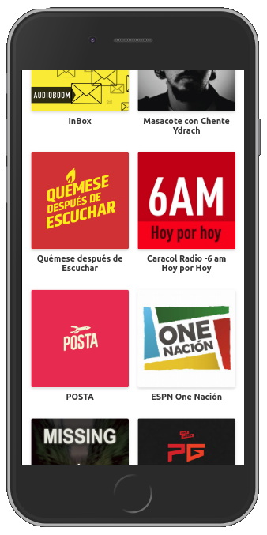
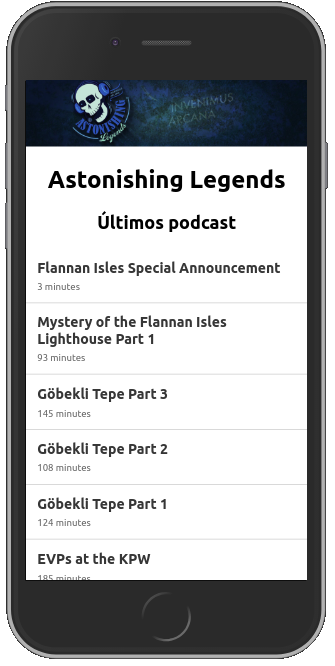
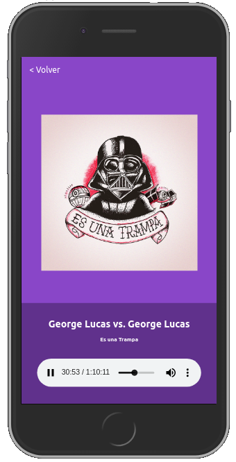

# Podcast app with Next.js

Trying Next.js framework using the AudioBoom API

## How does it work?
Requires Node.js 10

* `npm install` to install the dependencies.
* `npm run dev` to run in the development environment.
* `npm run build && npm start` to run in the production environment.

## License

MIT